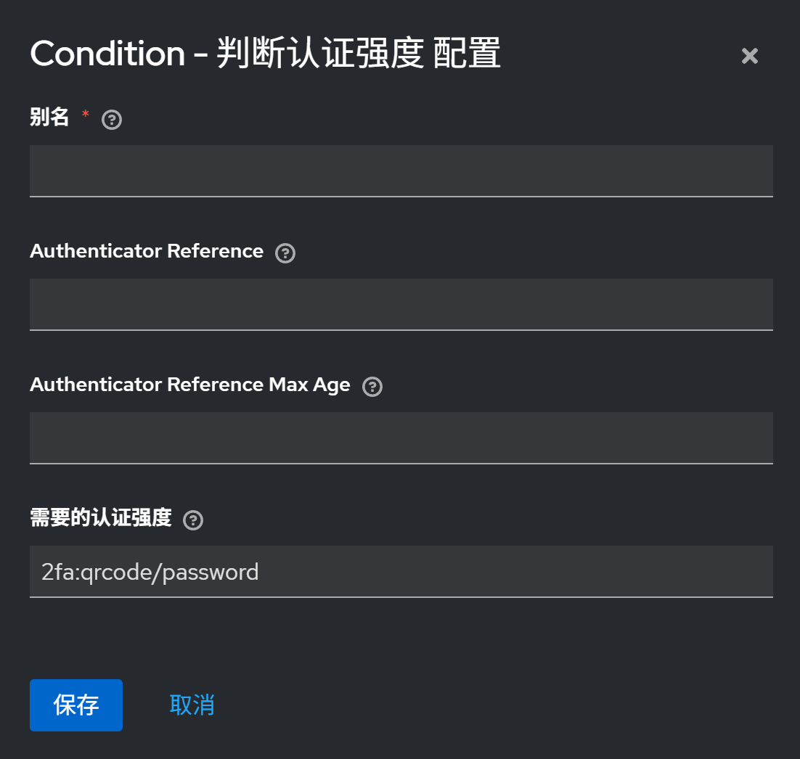

# Keycloak AcrValues Condition

这是一个Keycloak条件控制器插件，可根据`acr_values`值控制子认证流的执行，在使用Keycloak搭建逐级增强的认证流程的场景下可以发挥理想作用

Keycloak原生并不支持直接读取客户端上下文进行条件判断，但`acr_values`作为OIDC协议中的一个参数，应当被识别、读取，因而诞生了此插件

# 部署

## 本地构建

> [!note]
>
> 环境需求：
>
> - Maven
> - JDK19

1. 克隆本项目

   ```bash
   git clone git@github.com:FnICeN/Keycloak-AcrValues-Condition.git
   cd Keycloak-AcrValues-Condition
   ```

2. 执行打包

   ```bash
   mvn clean package
   ```

   打包的JAR文件位于`target/AcrCondition-JDK19.jar`

3. 放置文件

   将JAR文件复制到Keycloak安装目录下的`providers/`中

   - Keycloak标准部署：

     ```bash
     cp target/AcrCondition-JDK19.jar <Keycloak安装目录>/providers/
     ```

   - Keycloak部署于docker容器中：

     ```bash
     cp target/AcrCondition-JDK19.jar /opt/jboss/keycloak/standalone/deployments/
     ```

4. 构建

   - 生产环境下，在Keycloak安装目录下执行构建：

     ```bash
     bin/kc.sh build
     ```
   
   - 开发环境下，会在启动时自动构建
   
     ```bash
     bin/kc.sh start-dev
     ```

# 配置

> [!NOTE]
>
> 若遵循OIDC协议，需保证包含`acr_values`参数，或至少确保`authenticationFlowContext`中存在`acr_values`属性

## 启用插件

1. 以admin身份登录Keycloak管理后台
2. 边栏选择【身份验证】，再点击进入某流程详情页
3. 新建一个子流程
4. 为子流程新增条件，选择【Condition - 判断认证强度】
5. 将条件需求设置为【必需】
6. 点击条件栏右侧小齿轮，配置需要匹配的`acr_values`值



如上例，若`acr_values=2fa:qrcode/password`，则条件成立，条件所在的子流程被执行；否则不执行该子流程


